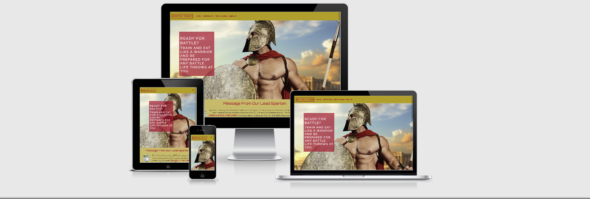

# Code Institute: First Milestone Project
# Spartan Training

Spartan Training is a fictional fitness website that aims to help and inform people on how to achieve their fitness goals. My aim with this project was to create a website for the user to learn more about workouts and diet plans with the option to sign-up for futher workout information.

I got the idea for this project to provide users with quick access to both workouts and diet plans as I found it difficult to locate a site that provides both pieces of information so readily. As I had just completed an introductory module on HTML, CSS and Bootstrap, I decided to implement HTML, CSS and Bootstrap in different ways throughout my project.

This was the first of four Milestone Projects that make up the Full Stack Web Development Program at The Code Institute. The main requirements were to make a static and responsive website with HTML5, CSS3 and Bootstrap.

Click here to view the project live. [Spartan Training](https://mckennadale.github.io/Spartan-Training/index.html)

# UX
## Main Aims

To provide a platform for users to learn more about workouts and diet plans in a community based enviorment.

To make the website look high value and appealing to the user through CSS and Bootstrap and the chance to sign up for more information regarding workouts and diet plans.

To make information regarding the workouts and diet plans quickly available to the user with videos showing how tohe workout should be done for the user.

To make it easy for users to make their way through each feature on the website, by having a navigation bar.

To create a design that would be fully responsive on all devices and screen sizes.

# User Stories
The following User Stories helped me to create a design that would satisfy the needs of various types of users.

# Project stakeholders
I am the creator of this platform and want to see it grow and succeed. I would like to attract users in the hope of helping users achieve their fitness goals and obtaining their best possible physique, and also increase the number of users who sign-up to the platform.
# New user
I am a user who has never really had an interest in physical activity. I want to use this website to learn more about workouts and diet plans and implement them into my lifestyle.
# Returning user
I have used this website to learn more about workouts especially the form that should be used with specific excercises by watching the videos, this has enabled me to get better results from my workouts and also prevents injuries.
# Tablet user
I am a user who prefers using my Ipad to browse the internet. I want to have a good experience on this website and enjoy the content as if I was using a desktop or laptop.

# Design Process

Strategy plane: From the onset, I knew that my primary aim was to help users have quick easy access to high quality workouts and diet plan material, in a way that made users feel part of something, engaging and memorable. As I had just begun to develop my Coding skills, my aim for this particular project was to design a project that combined what I have learned so far. I then started the UX process by creating a list of User Stories above, they enabled me to create a platform the would find valuable and useful.

Scope plane: Having decided the main purpose for the project, I began identfying the key features i wanted the platform to feature. To do so, I focused on the features and style I wanted to implement, as I knew this would be important in creating an enjoyable experience for the user. This led me to decide that I wanted to focus on a site with three features: a workout page, a meal plan page and a sign up page.

Strcuture plane: Once I had the features I wanted to include, I began to structure my design into four seperate pages: 'Home', 'Workouts', 'Meal Plans', 'Sign Up'. The 'Home' page would welcome users to the project with a inspiring hero image and info regarding the company. The user can then continue to 'Workouts' to learn and see a daily workouts, the user can then proceed to: 'Meal Plans'. The user can then proceed to the 'Sign Up' page to sign up for new workouts and meal plans.

Skeleton plane: As though out in the structre plane, I considered the main way for the user to navigate the website, through the a fixed navbar. The reason for this was to give the user a simple way to navigate through the site. The user can navigate through the site a view the content eaily learning about workous and meal plans before then having the option to sign up.

Surface plane:

* For my design to work, I knew that it would be extremely important to create a platform that looked high value and created a community feel to stand out from the competition. There is a lot of bodybuilding and gym sites, as nowadays it has become a really popular area with lots of content available to internet users. My first design decision was to create a platform that stood out and scramed different from all other workout sites, rather than something users have seen before, with valuable color scheme and inspiring images that would inspire the user and make them buy into the Spartan community.

* With this aim, I began creating and experimenting with my wireframes on wireframe.cc. As this was my first Milestone Project I found this difficult to master at the beginning, I found it useful to see the layout of my design on a screen as opposed to just in my head. When settling on the color scheme I went with traditional Spartan colors of gold and red: I began searching the red and gold that would best represent Spartan Training, I used the website HTML Color Codes which gives suggestions of which colors compliment each other, the red (#BB0627) was found on HTML Color Codes, whilst the gold rgba(187, 154, 6, .7) compliments the red color well and really embodies the color of a spartan warrior.

* I used Google Fonts to selct the fonts that would be used in my project. I wanted to find two similar fonts that would fit in with the spartan theme i had envisioned for my site. As a result, I settled for Orbitron for the majority of the site and Raleway for other parts.

* With the wireframes complete. I created the basic structure and code with HTML, CSS and Bootstrap from my earlier modules the Code Institute gave outstanding examples of using the Bootstrap grid system and great design ideas.

## Note:
*The original color scheme for the site was to be sky blue and white as can be seen from the wireframes below. However this did not really represent the look and feel i wanted the site to have. There was alos some structural changes made to the original wireframes as they did not give the value i had been hoping they would.*

# Wireframing on Wireframe.cc

# Features

## Existing Features
This project consists of four pages, all four pages can be accessed using the navbar, index.html can also be accessed by clicking on the Spartan Training title.

### Features across all pages

* The navbar and footer is consistent throughout the website.
* Each page features and red and gold color scheme, the font remains the same on all pages.
* All pages apart form the sign-up page feature an inspiring fixed hero image with a zoom feature.

### Home

* The user is introduced to a powerful inspiring homepage, with inspirational text to compliment the image.
* The user is then presented with information of how Spartan Training was formed.
* Below this the user can read about Spartan Training's values and promise to them.

### Workouts

* In the workout section the user is introduced to various workouts, which have been organised into a daily workouts for each body part.
* Each day has four workouts for the user to follow, which informs the user how many reps they should perform, weight they should use and rest period in between workouts.
* Below each workout there is a see how you do it button which takes the user to a youtube video instructing the user how to perform the exercise safely and effectively.
* Each section of the workout page is horizontally divided.

### Meal Plans 

* In the meal plans section the user is introduced to a daily meal plan to follow. Each day consists of three meals morning, afternoon and evening.
* The user is provided with a simple and effective diet plan to help the user achieve their desired goals.
* Each section of the meal plans page is horizontally divided.

### Sign Up 

* The user is then introduced to the sign up page which is set on a red background a gives the user information regarding why they would sign up.
* Once the user has filled in the necessary fileds and clicks sign up a modal pops up informing the user they have sucessfully signed up and gives them the option to close the pop up or to return to the homepage

### Features Left to implement

* A feature I would like to implement you'd be a backend feature that informs me someone has signed up and will also send the user an email thanking them for signing and providing weekly workout tips and other information the user may find interesting.
* Another additional feature would be to add a member's section where users can sign in and access and community based page where they can track progress and share their stories with other members.

# Technologies Used

### Languages, libraries, frameworks, editors and version control

#### HTML5
The language used to create the form and add content to the website.

#### CSS3
The language used to style the HTML5 elements according to the design colour scheme.

#### jQuery
I used the jQuery library to help write the code for my hamburger menu.

#### Bootstrap framework
I decided to use Bootstrap's grid container system as I wanted to design my project with a 'mobile first' approach.

#### Gitpod
I relied on Gitpod's dev environment to write the code for my project.

#### Git Version Control
I used Git for Version Control to track and record changes to my code and refer back when needed.

#### GitHub
I hosted my deployed website to GitHub, with previous versions of my code stored through the commit history.

# Additional tools used

#### Wireframe.cc
Wireframe.cc helped me design my project, by creating wireframes for my project.

#### Google Fonts
I used two complementary fonts from Google for my project: Orbitron and Raleway.

#### W3C Markup Validation Service
This was a great tool throughout the project to check whether there were any errors in my HTML and CSS code.

#### Am I responsive
My mentor advised to use this tool it shows your site on various platforms to test responsiveness.

#### Chrome Developer tools
I used the Chrome Developer tools throughout my project to view padding and margin errors and also responsiveness.

# Testing

# Deployment

#### Deploying my project
I created my project on GitHub and used GitPod's development environment to write my code. Use the following link to view my live project: [Spartan Training](https://mckennadale.github.io/Spartan-Training/index.html)

#### Deploying to GitHub Pages
To make my project viewable to others, I deployed my project to GitHub Pages with the following process:

* I opened the 'Settings' section of my project repository in GitHub.
* From there, I scrolled to the 'GitHub Pages' section.
* Here I selected 'master branch' as my Source.
* This deployed my project on GitHub Pages and allowed me to share the live website with others.

# Cloning my project
If you would like to work on my project further you can clone it to your local machine using the following steps:

1. Scroll to the top of my repository and click on the "clone or download button"
1. Decide whether you want to clone the project using HTTPS or an SSH key and do the following:
   * HTTPS: click on the checklist icon to the right of the URL
   * SSH key: first click on 'Use SSH' then click on the same icon as above
1. Open the 'Terminal'
1. Change the current working directory to the location where you want the cloned directory
1. Type 'git clone', and then paste the URL you copied earlier.
1. Press 'Enter' to create your local clone.

